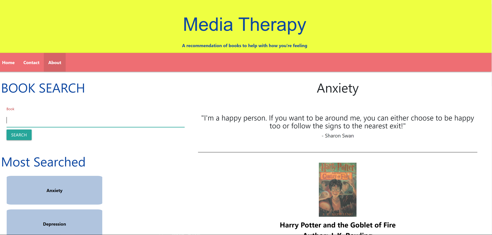
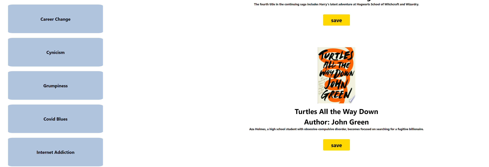
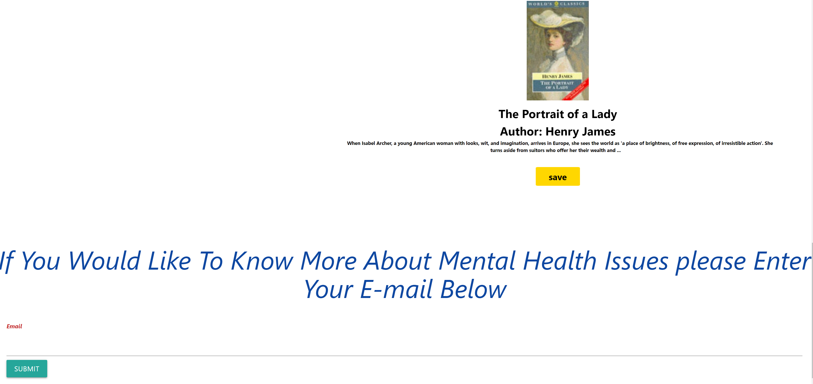

# Media-Therapy

## Purpose
The purpose of this page is to provide anyone suffering from various kinds of problems a database where they can find various book featuring a fictional characters that share similar circumstances, hopefully helping them through the power of fiction 

## Built With
* HTML
* CSS
* Javascript
* Materialize
* JQuery
* Google Books API

# Website
https://nsmall94.github.io/Media-Therapy/

## Screenshot

## contribution
Made By: 
Dan Natale,
Symone Seldon,
Nick Small